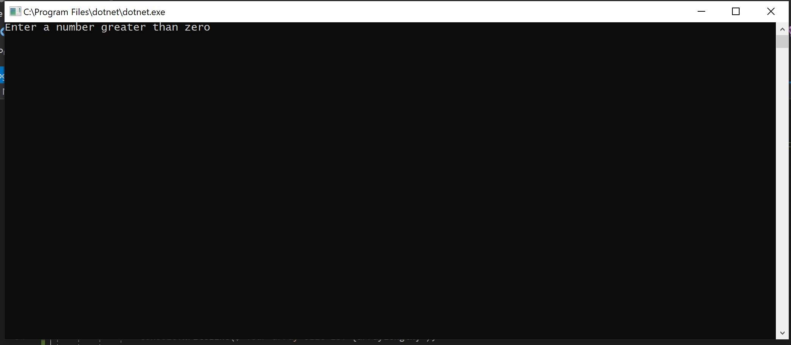
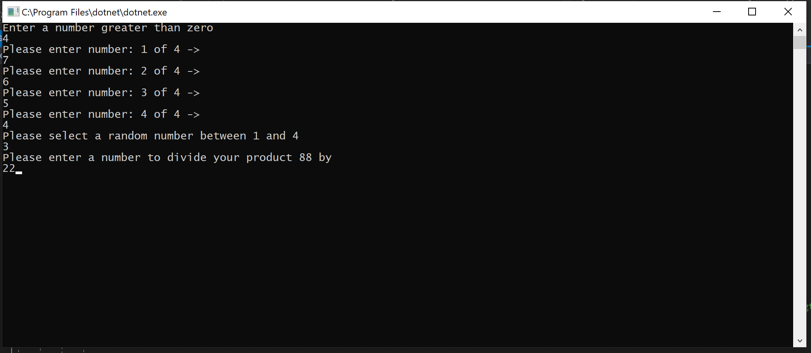
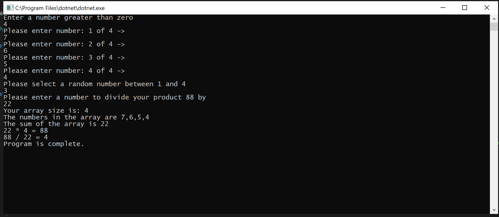

# Lab01-NumbersGame

# ***Console Application README Example***
------------------------------

# Numbers Game
#### Lab01-NumbersGame
##### *Author: Mike Kelly*

------------------------------

## Description
***[Tell me about your application, should be about a paragraph]***
This is a C# console application that will ask a user to give a lenth of an array.  Input the integers in the array, an index number, and a divisor.  It will then manipulate the numbers accordingly.

------------------------------

## Getting Started
Clone this repository to your local machine.
```
$ git clone [https://github.com/Michael-S-Kelly/Lab01-NumbersGame.git]
```
#### To run the program from Visual Studio:
Select ```File``` -> ```Open``` -> ```Project/Solution```

Next navigate to the location you cloned the Repository.

Double click on the ```Lab01-NumbersGame``` directory.

Then select and open ```NumbersGame.sln```

------------------------------

## Visuals
***[Add screenshots of your application in action]***

##### Application Start

##### Using the Application

##### Application End


------------------------------

## Change Log
***[The change log will list any changes made to the code base. This includes any changes from TA/Instructor feedback]***


------------------------------
## Collaborators, Contributors, and Other Resources used

### Collaborators

### Contributors
Phil Werner
Andrew Roska

### Other Resources
C# 7.0 Pocket Reference

------------------------------
For more information on Markdown: https://www.markdownguide.org/cheat-sheet
